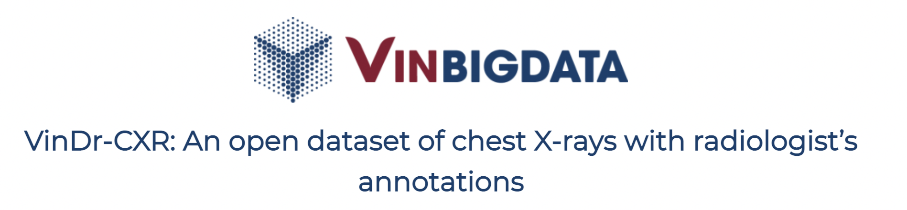
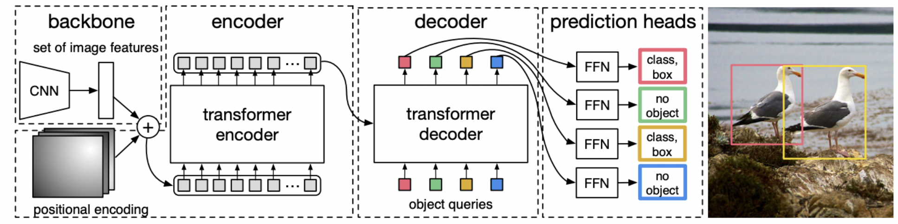
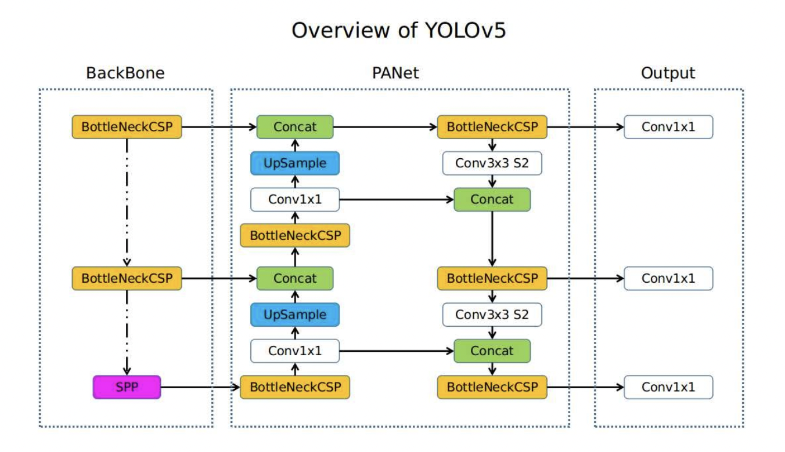
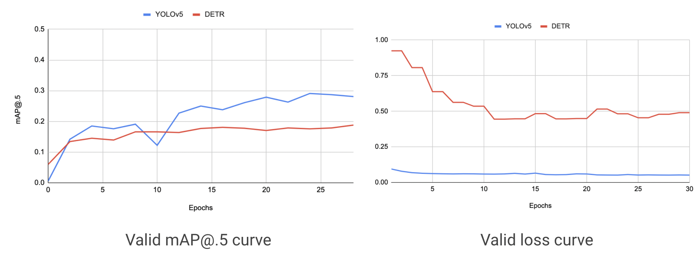
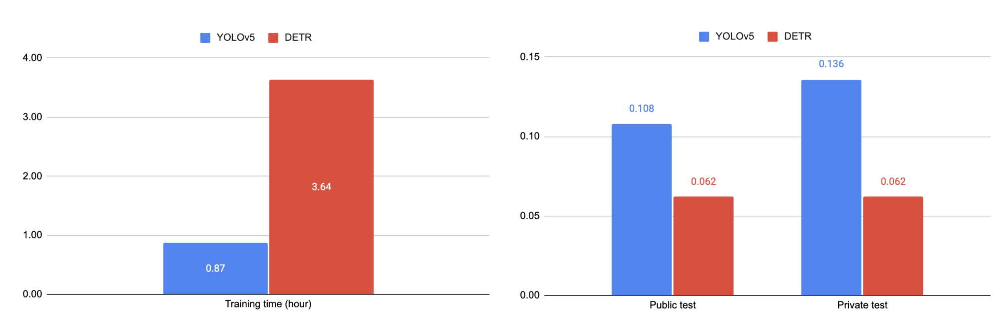
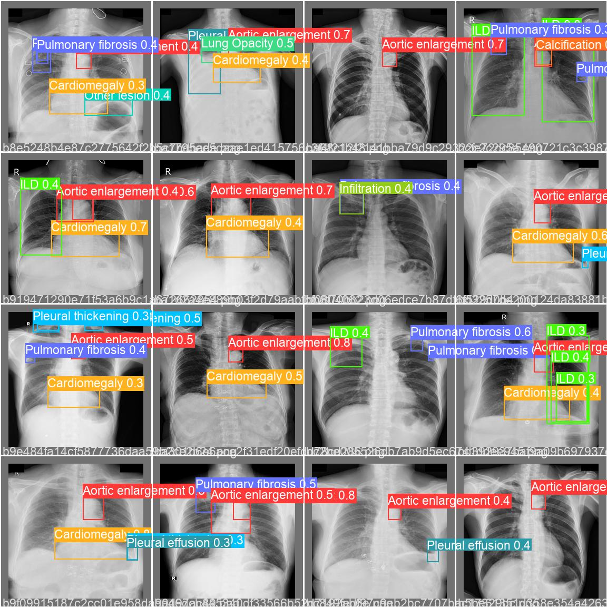

<div align='center'>

## Different deep learning approaches in detecting various abnormalities via Chest X-Ray images
</div>

In this work, we would like to introduce 2 of the highlighted neural architectures in the field of object detection, which are: *[DEtection TRansformer](https://arxiv.org/abs/2005.12872)* and *[You Only Look Once](https://github.com/ultralytics/yolov5)*. After that, we shall compare the performance between 2 these architectures via applying into the problem of detecting various abnormalities using CXR images. And finally, we will introduce our demo for this work.      

### Table of contents
1. [Introduction](#1-introduction)
2. [Repo structure](#2-repo-structure)
3. [Demo](#3-demo)
4. [Experimental configuration](#4-experimental-configuration)
5. [Pretrained model](#5-pretrained-model)
6. [Results](#6-results)
7. [References](#7-references)

---

### 1. Introduction
😇 Our seminar towards this problem is [here](https://docs.google.com/presentation/d/1yuXYOfvzT87p70bg9UB8lxxuV51fv76dW3TDGhrJR4g/edit?usp=sharing)
#### Dataset
- Our dataset is taken from [VinDr-CXR](https://vindr.ai/datasets/cxr).
<div align='center'>


</div>

- Our dataset consists of 18 000 postero-anterior (PA) view Chest X-Rays (CXR) scans from a set of more than 100 000 raw images. They are all annotated by a group of 17 radiologists with at least 8 years of experience.    

- Among 18 000 CXR scans, there are 5 000 scans served as training set, and 3 000 others as test set. The original size was `1024 x 1024` but we did resize them into `256 x 256` and change image format from DICOM into PNG.

#### Architectures
Here we use 2 architectures, which are: *[DEtection TRansformer](https://arxiv.org/abs/2005.12872)* and *[You Only Look Once](https://github.com/ultralytics/yolov5)*.     

- **DEtection TRansformer (DETR)**: Proposed by Nicolas Carion and Francisco Massa from Facebook AI in 2020. DETR was first introduced to eliminate handmade's interference on postprocessing step effectively but still maintain the high performance compared to other methods.    

<div align='center'>


</div>

- **You Only Look Once (YOLOv5)**: Object recognition systems from the YOLO family are often used for vehicle recognition tasks, and have been shown to outperform other target recognition algorithms. YOLOv5 has proven to significantly improve the processing time of deeper networks. This attribute will gain in importance when moving forward with the project to bigger datasets and real-time detection.     

<div align='center'>


</div>

### 2. Repo structure
- **assets**: images used for this readme
- **Model**
    - **DETR.ipynb**
    - **YOLOv5.ipynb**
- **gitignore**
- **LICENSE**

### 3. Demo
#### How to run model in local

##### Download nodeJS
- First, you need to download [NODEJS](https://nodejs.org/en/). Node.js is an open-source, cross-platform, JavaScript runtime environment. To get more infomation about Node.js, please see the [Node.js Website](https://nodejs.org/en/). 

##### Install dependencies

- In your terminal, run this script to init:
```{bash} 
chmod +x src/dependencies.sh && ./src/dependencies.sh
```
- Run 
```{bash}
node src/index.js
```

### 4. Experimental configuration

- Proceeded in 30 epochs with GPU: `NVIDIA @ Tesla P100-PCIE-16GB`, RAM: 26GB and Pytorch framework
- Both architectures are trained and validated using 5-fold cross validation on training set; then tested on test set
- Use pretrained YOLOv5x and pretrained DETR on COCO val-2017
- Use ResNet50 as their own CNN backbone
- DETR’s learning rate is 3e-5 and YOLOv5x’s learning rate is 0.01


### 5. Pretrained model
- [YOLOv5x](https://drive.google.com/file/d/1ZckQYba28BkCLZX0ASgvM6THhhEjZTlf/view)
- [DETR](https://drive.google.com/file/d/1BDjRhMsuryTS8oQ6uWRD8RM7Sf7JC547/view)


### 6. Results

<div align='center'>
    
**Private score on Kaggle's VinBigData Chest X-ray Abnormalities Detection contest**

</div>

<div align='center'>
    
| | Private score (mAP) |
|:--:|:--:|
| Rank 1 | 0.314 |
| Rank 2 | 0.307 | 
| ... | ... |
| Rank 1005 | 0.137 |
| **Our YOLOv5** | **0.136** | 
| ... | ... |
| Rank 1099 | 0.064 | 
| **Our DETR** | **0.062** | 
| ... | ... |
</div>

<div align='center'>

**Training curve and valid loss curve on 2 architectures**




**Comparison between 2 architectures**



        
</div>


<div align='center'>    

**An example of output for a batch of 32 images**


</div>


### 7. References
[1]  Carion, N., Massa, F., Synnaeve, G., Usunier, N., Kirillov, A., & Zagoruyko, S. (2020, August). End-to-end object detection with transformers. In European Conference on Computer Vision (pp. 213-229). Springer, Cham.      

[2]  Stewart, R.J., Andriluka, M., Ng, A.Y.: End-to-end people detection in crowded scenes. In: CVPR (2015)     

[3]  Nguyen, H. Q., Lam, K., Le, L. T., Pham, H. H., Tran, D. Q., Nguyen, D. B., ... & Vu, V. (2020). VinDr-CXR: An open dataset of chest X-rays with radiologist's annotations. arXiv preprint arXiv:2012.15029      

[4]  G. Jocher, A. Stoken, J. Borovec, A. Chaurasia, L. Changyu, V. Abhiram, A. Hogan, A. Wang, J. Hajek, L. Diaconu, Y. Kwon, Y. Defretin, A. Lohia, B. Milanko, B. Fineran, D. Khromov, D. Yiwei and F. Ingham, ultralytics/yolov5: v5.0 - YOLOv5-P6 1280 models, AWS, Supervise.ly and YouTube integrations, Zenodo, 2021      

[5]  Cai, Z., & Vasconcelos, N. (2019). Cascade r-cnn: High quality object detection and instance segmentation. IEEE Transactions on Pattern Analysis and Machine Intelligence.        

[6]  Zhou, X., Wang, D., & Krähenbühl, P. (2019). Objects as points. arXiv preprint arXiv:1904.07850.       

[7]  Tsung-Yi Lin, Michael Maire, Serge Belongie, James Hays, Pietro Perona, Deva Ramanan, Piotr Dollar, and C Lawrence ´ Zitnick. Microsoft coco: Common objects in context. In ECCV, 2014.      

